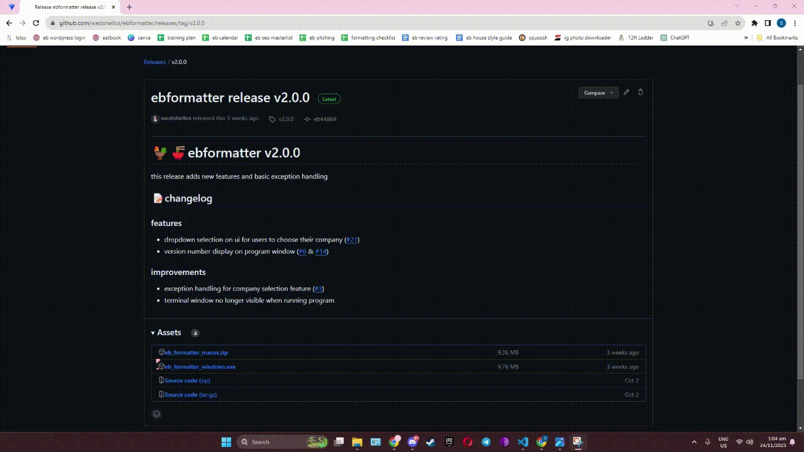
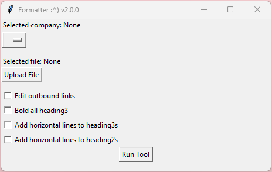
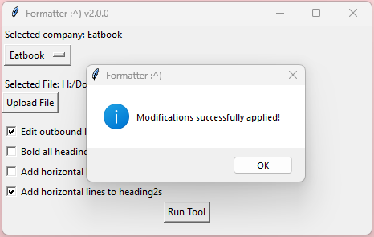

# 🐓🍜ebformatter
ebformatter is a tool that optimizes the formatting of blog posts. it has more specifically been designed around [TheSmartLocal](https://thesmartlocal.com/)'s content format and managing system. 

with ebformatter, uploading articles becomes faster and more efficient as it minimizes repetitive actions and reduces proofreading times. 

writers at TSL can:
- configure all outbound links to open in new tab in one click
- ensure that headers are bolded and wrapped with horizontal lines where needed
- (wip) have listicle entries be numbered in order automatically

the guide below is written for writers with no experience with code. 
 
## installation
head to [releases](https://github.com/westshellos/ebformatter/releases) and scroll down until you see . depending on your operating system, follow the instructions in the respective dropdowns:

 windows 

1.  click on the .exe file to start the download.
2.  your browser might warn you that the file might be dangerous. proceed to download anyway. 
3.  once it’s finished downloading, locate the .exe file on your file explorer.
4.  click and drag the file onto your desktop for easy access in the future. 

<u>demo on chrome:</u>

 macos 

#### step 1 - download the .zip file

#### step 2 - unzip the file

## usage
<i> <u>note</u>: the formatter removes some spaces between paragraphs, so i recommend using the formatter BEFORE you add photos to your post so that you can add the spaces as you edit later. </i>

1. copy your blog post's html into a .txt file by doing the following:
      
   <u>1.1</u> open the post you would like to format on wordpress.
   
   <u>1.2</u> on the word editor, you should see the  tab on the upper right corner. 
   
   <u>1.3</u> switch the tab to "text" and select the entire post, then copy the contents. 
   
   <u>1.4</u> create a new .txt file anywhere on your file explorer and name it however you choose. <b> make sure you remember the location and name of this file. </b>
   
   <u>1.5</u> paste the contents that you copied in step 1.3 into the .txt file. 
2. open ebformatter. the first time you open the app, you might get a warning about the file being dangerous; proceed to run anyway. afterwards, you should see this window pop up:
   
3. select your company using the dropdown menu.
4. select and upload the .txt file using the "upload file" button.
5. check the boxes corresponding to which edits you want to make to your post.
6. click "run tool". once edits are made, you will see another pop-up window:
   
7. open your file explorer and navigate to where you saved your original .txt folder, and there should be the a new file with the modified content.
8. open the new .txt file, then select and copy the contents.
9. head back to the post on wordpress and paste the copied contents over the original content. <b> make sure to be on the "text" tab when you do this. </b>
10. check the preview and the edits should show up. 🤗

<u>demo on windows:</u>

placeholder

## release history
[v2.0.0](https://github.com/westshellos/ebformatter/releases/tag/v2.0.0)

## meta
shannon – shann200008@gmail.com

distributed under the GNU general public license. see [LICENSE](https://github.com/westshellos/ebformatter/blob/main/LICENSE) for more information.